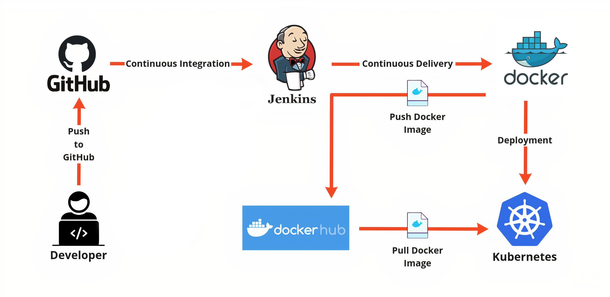
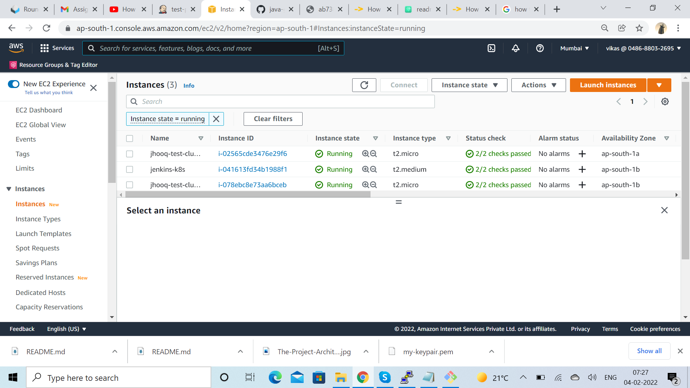
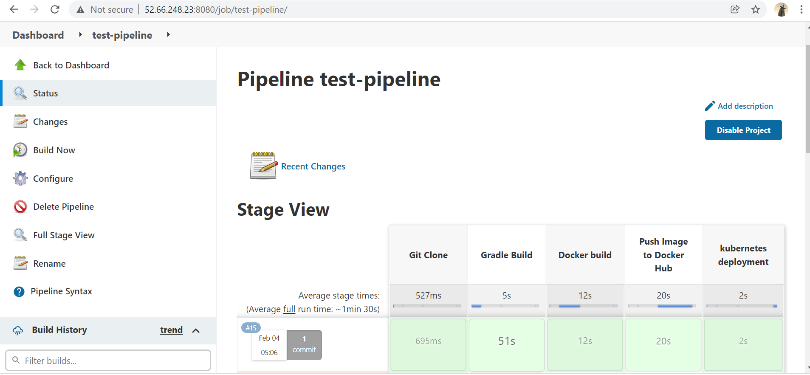
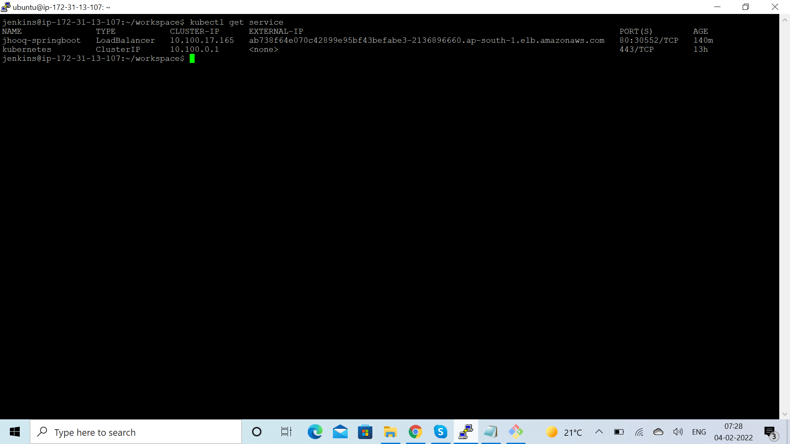
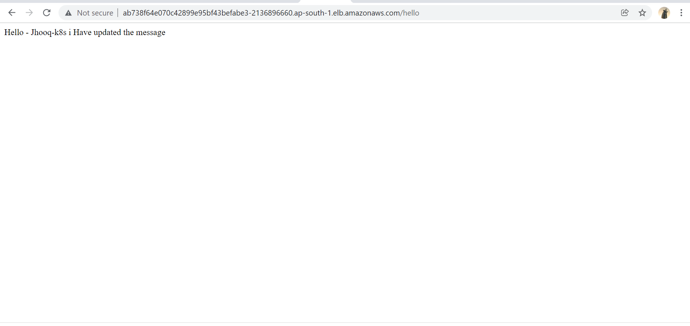

# Simple-Devops Project

A simple springboot application to demonstrate ci/cd pipeline with jenkins, gradle, docker, and kubernetes.

## Tools

1. git - source code management
2. jenkins - ci/cd pipeline
3. gradle - for build tools
4. docker - as a target environment to host the application
5. kubernetes - to manage the docker containers

## Flow
   Once the developer develops a new feature, the source code is pushed to the git. The latest source code is then taken by Jenkins and build artifacts from it with the help of gradle build tool. The artifact should be deployed to a target environment like docker or kubernetes
## Table of Content

1. Setup an AWS EC2 Instance
2. Connect to EC2 Instance
3. Install JDK on AWS EC2 Instance
4. Install and Setup Jenkins
5. Update visudo and assign administrative privileges to Jenkins user
6. Install Docker
7. Install and Setup AWS CLI
8. Install and Setup Kubectl
9. Install and Setup eksctl
10. Create eks cluster using eksctl
11. Add Docker and GitHub Credentials into Jenkins
12. Add jenkins stages
13. Build, deploy and test CI CD pipeline

## 1. Setup an AWS EC2 Instance

The first step would be for us to set up an EC2 instance and on this instance, we will be installing -

1. JDK
2. Jenkins
3. eksctl
4. kubectl

## 1.1 Launch EC2 instance

1. But first let’s head over to AWS and in the search box type in ec2
2. Click on the EC2 and after that, you need to look for the Launch Insance option -
3. Now select the image type for the EC2 instance(For this we are going to select Ubuntu Server 20.04)
4. Choose an Instance Type.
   we are going to use t2.medium because we will be installing Jenkins and t2.micro will not be sufficient enough to setup Jenkins
5. Configure Instance Details - you can simply verify the detail and proceed to add the storage part.
6. Add storage - In general 8 Gib of memory is sufficient enough for setting up Jenkins
7. Configure Security group - This is an important step because here we need to add Custom TCP Port 8080, if you do not add this port then you will not be able to access Jenkins using the public IP address of the AWS EC2 instance.
8. Finally click on review and launch
9. But before you launch your EC2 instance you need to create and download the key pair(private key and public key)
10. Type in the key pair name and then click on the Download Key Pair

## 2. Connect to EC2 Instance
     2.1 Once the instance state is Running you can select the instance and click on Connect
     2.2 We will connect using SSH Client -
     2.3 We will use the jenkins-ec2.pem file to connect, so carefully copy the ssh command. (Following command will be different for you because the IP address of EC2 instance will always be different for you and also you need to supply your server pem file)

## 3.  Install JDK on AWS EC2 Instance

     3.1 The next requirement is we need to install JAVA(JDK) on the EC2 instance.
     3.2 Now before we do the JDK installation lets first update the pack
         age manager of the virtual machine 

## 3.3 commands

     sudo apt-get update  

     java -version 

     sudo apt install openjdk-11-jre-headless
     

## 4. Install and Setup Jenkins   

      4.1 The next step would be to install the Jenkins. You can follow the official Jenkins Installation guide also. But here I have listed down the steps for installing the Jenkins on the EC2 instance.

   ## 4.1  commands   

   wget -q -O - https://pkg.jenkins.io/debian-stable/jenkins.io.key | sudo apt-key add -

   sudo sh -c 'echo deb https://pkg.jenkins.io/debian-stable binary/ > /etc/apt/sources.list.d/jenkins.list'  

   sudo apt-get update 

   sudo apt-get install jenkins

   sudo service jenkins status 

## 4.2 Setup jenkins
   
   1. After installing jenkins lets go back to AWS dashboard -> EC2 -> Instances(running)
   2. Click on the instance ID as mentioned in the above image.

     Now we need to find the public IP address of the EC2 machine so that we can access the Jenkins.

     Once you click on the instance ID you should see the following page with lots of information about the EC2 instance.

     We need to look for Public IPv4 address
   3. Alright now we know the public IP address of the EC2 machine, so now we can access the Jenkins from the browser using the public IP address followed by the port 8080
   4. If you are installing the Jenkins for the first time then you need to supply the initialAdminPassword and you can obtain it from -
     
      sudo cat /var/lib/jenkins/secrets/initialAdminPassword
   5. Copy the password and paste it into the initial page of the Jenkins. After that, Jenkins will prompt you for installing the plugins.

      Opt for install suggested plugin -

      And now your Jenkins is ready for use

 ## 4.3 4.2 Setup Gradle
 we will be using the Spring Boot Application, so we need to use a build tool for compilation and building the JAR file and for that, we will be using Gradle as the preferred tool.

For setting up the gradle Goto -> Manage Jenkins -> Global Tool Configuration -> Gradle     

## 5. Update visudo and assign administration privileges to jenkins user
      Now we have installed the Jenkins on the EC2 instance. To interact with the Kubernetes cluster Jenkins will be executing the shell script with the Jenkins user, so the Jenkins user should have an administration(superuser) role assigned forehand.

      Let’s add jenkins user as an administrator and also ass NOPASSWD so that during the pipeline run it will not ask for root password.

      Open the file /etc/sudoers in vi mode

      sudo vi /etc/sudoers 
       
      Add the following line at the end of the file
      jenkins ALL=(ALL) NOPASSWD: ALL 

      After adding the line save and quit the file.
      Now we can use Jenkins as root user and for that run the following command -

      sudo su - jenkins  

## 6.  Install Docker
        Now we need to install the docker after installing the Jenkins.
        The docker installation will be done by the Jenkins user because now it has root user privileges.      
      
      Use the following command for installing the docker -
      sudo apt install docker.io

## 6.1 Add jenkins user to Docker group
       Jenkins will be accessing the Docker for building the application Docker images, so we need to add the Jenkins user to the docker group.

       sudo usermod -aG docker jenkins  

## 7 Install and Setup AWS CLI
Okay so now we have our EC2 machine and Jenkins installed. Now we need to set up the AWS CLI on the EC2 machine so that we can use eksctl in the later stages

Let us get the installation done for AWS CLI

sudo apt install awscli 
BASH
Verify your AWS CLI installation by running the following command -

aws --version 
It should return you with the version of CLI

aws-cli/1.18.69 Python/3.8.5 Linux/5.4.0-1045-aws botocore/1.16.19 

## 7.1  Configure AWS CLI
Okay now after installing the AWS CLI, let’s configure the AWS CLI so that it can authenticate and communicate with the AWS environment.

To configure the AWS the first command we are going to run is -

aws configure 
Once you execute the above command it will ask for the following information -

1. AWS Access Key ID [None]:
2. AWS Secret Access Key [None]:
3. Default region name [None]:
4. Default output format [None]:
   You can find this information by going into AWS -> My Security Credentials

   Then navigate to Access Keys (access key ID and secret access key)
    You can click on the Create New Access Key and it will let you generate - AWS Access Key ID, AWS Secret Access Key.
   
## 8. Install and Setup Kubectl
Moving forward now we need to set up the kubectl also onto the EC2 instance where we set up the Jenkins in the previous steps.

Here is the command for installing kubectl

curl -LO "https://storage.googleapis.com/kubernetes-release/release/$(curl -s https://storage.googleapis.com/kubernetes-release/release/stable.txt)/bin/linux/amd64/kubectl"
chmod +x ./kubectl 
sudo mv ./kubectl /usr/local/bin
BASH

Verify the kubectl installation
Verify the kubectl installation by running the command kubectl version and you should see the following output

Client Version: version.Info{Major:"1", Minor:"21", GitVersion:"v1.21.2", GitCommit:"092fbfbf53427de67cac1e9fa54aaa09a28371d7", GitTreeState:"clean", BuildDate:"2021-06-16T12:59:11Z", GoVersion:"go1.16.5", Compiler:"gc", Platform:"linux/amd64"}
Error from server (Forbidden): <html><head><meta http-equiv='refresh' content='1;url=/login?from=%2Fversion%3Ftimeout%3D32s'/></head><body style='background-color:white; color:white;'> 

## 9. Install and Setup eksctl
The next thing which we are gonna do is to install the eksctl, which we will be using to create AWS EKS Clusters.

Okay, the first command which we are gonna run to install the eksctl

 curl --silent --location "https://github.com/weaveworks/eksctl/releases/latest/download/eksctl_$(uname -s)_amd64.tar.gz" | tar xz -C /tmp
BASH
sudo mv /tmp/eksctl /usr/local/bin 
BASH
Verify the installation by running the command -

eksctl version
BASH
And it will return you with the version -

0.52.0 
BASH
So at the time of installation, I had 0.52.0

Installing eksctl on other OS
For Mac OS
brew tap weaveworks/tap
brew install weaveworks/tap/eksctl
For Windows
 chocolatey install eksctl
BASH
or Scoop

 scoop install eksctl
BASH

## 10. Create eks cluster using eksctl
In all the previous 9 steps we were preparing our AWS environment. Now in this step, we are going to create EKS cluster using eksctl

You need the following in order to run the eksctl command

Name of the cluster : –name jhooq-test-cluster1
Version of Kubernetes : –version 1.17
Region : –name eu-central-1
Nodegroup name/worker nodes : worker-nodes
Node Type : t2.micro
Number of nodes: -nodes 2
Here is the eksctl command -

### 10.1 Verify the EKS kubernetes cluster from AWS
  You can go back to your AWS dashboard and look for Elastic Kubernetes Service -> Clusters

eksctl create cluster --name jhooq-test-cluster --version 1.17 --region eu-central-1 --nodegroup-name worker-nodes --node-type t2.micro --nodes 2
(*Note - Be patient with the above command because it may take 20-30 minutes to complete)

For me it almost took 20 minutes, here are the timestamps

## 11.  Add Docker and GitHub Credentials into Jenkins
As we know Kubernetes is a container orchestration tool and container management we are using docker.

(In case if you haven’t set up Docker Hub Account then please create a DockerHub Account because we are gonna need it.)

Alright so if you are reading this line then I am assuming you have a DockerHub Account and GitHub Account.

### 11.1 Setup Docker Hub Secret Text in Jenkins
You can set the docker credentials by going into -

Goto -> Jenkins -> Manage Jenkins -> Manage Credentials -> Stored scoped to jenkins -> global -> Add Credentials    

### 11.2 Setup GitHub Username and password into Jenkins
Now we add one more username and password for GitHub.

Goto -> Jenkins -> Manage Jenkins -> Manage Credentials -> Stored scoped to jenkins -> global -> Add Credentials

## 12.  Add jenkins stages
Okay, now we can start writing out the Jenkins pipeline for deploying the Spring Boot Application into the Kubernetes Cluster.

### 12.1 Jenkins stage-1 : Checkout the GitHub Repository
Add the following Jenkins script for checking out the GitHub Repository -
              stage("Git Clone"){

        git credentialsId: 'GIT_HUB_CREDENTIALS', url: 'https://github.com/rahulwagh/k8s-jenkins-aws'
    }
BASH

### 12.2 Jenkins stage-2 : Gradle compilation and build
Now after checking out the repository let compile and build the application using Gradle

stage('Gradle Build') {
    sh './gradlew build'
}

### 12.3 Jenkins stage-3 : Create Docker Container and push to Docker Hub
After successful compilation and build let’s create a Docker image and push to the docker hub

stage("Docker build"){
    sh 'docker version'
    sh 'docker build -t jhooq-docker-demo .'
    sh 'docker image list'
    sh 'docker tag jhooq-docker-demo rahulwagh17/jhooq-docker-demo:jhooq-docker-demo'
}

stage("Push Image to Docker Hub"){
        sh 'docker push  rahulwagh17/jhooq-docker-demo:jhooq-docker-demo'
}

### 12.4 Jenkins stage-4 : Kubernetes deployment
Finally, do the Kubernetes deployment

stage("kubernetes deployment"){
  sh 'kubectl apply -f k8s-spring-boot-deployment.yml'
}
BASH
Here is the complete final script for Jenkins pipeline -

node {

    stage("Git Clone"){

        git credentialsId: 'GIT_HUB_CREDENTIALS', url: 'https://github.com/rahulwagh/k8s-jenkins-aws'
    }

     stage('Gradle Build') {

       sh './gradlew build'

    }

    stage("Docker build"){
        sh 'docker version'
        sh 'docker build -t jhooq-docker-demo .'
        sh 'docker image list'
        sh 'docker tag jhooq-docker-demo rahulwagh17/jhooq-docker-demo:jhooq-docker-demo'
    }

    withCredentials([string(credentialsId: 'DOCKER_HUB_PASSWORD', variable: 'PASSWORD')]) {
        sh 'docker login -u rahulwagh17 -p $PASSWORD'
    }

    stage("Push Image to Docker Hub"){
        sh 'docker push  rahulwagh17/jhooq-docker-demo:jhooq-docker-demo'
    }
    
    stage("kubernetes deployment"){
        sh 'kubectl apply -f k8s-spring-boot-deployment.yml'
    }
} 

## 13. 13. Build, deploy and test CI/CD pipeline
Create new Pipeline: Goto Jenkins Dashboard or Jenkins home page click on New Ite

Add pipeline script: Goto -> Configure and then pipeline section.

Copy the Jenkins script from Step 12 and paste it there.

Build and Run Pipeline: Now goto pipeline and click on build now

Verify using kubectl commands
You can also verify the Kubernetes deployment and service with kubectl command .e.g kubectl get deployments, kubectl get service

or can access the rest end point from browser using the EXTERNAL-IP address

    
## Tools

1. git - source code management
2. jenkins - ci/cd pipeline
3. gradle - for build tools
4. docker - as a target environment to host the application
5. kubernetes - to manage the docker containers

## Flow
   Once the developer develops a new feature, the source code is pushed to the git. The latest source code is then taken by Jenkins and build artifacts from it with the help of gradle build tool. The artifact should be deployed to a target environment like docker or kubernetes

   
   
   
   
   